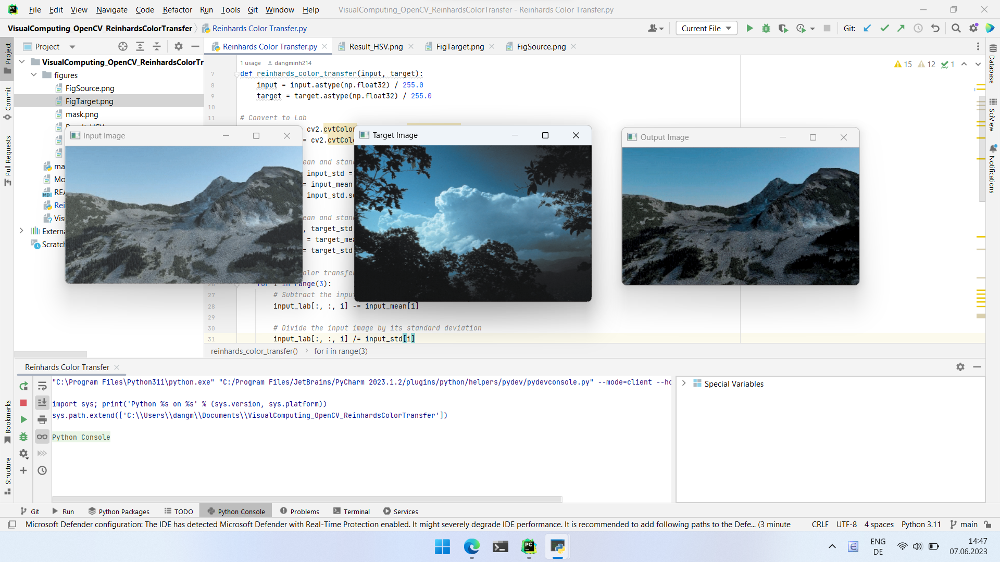

# VisualComputing_OpenCV_ReinhardsColorTransfer
Ein OpenCV Projekt von Visual Computing Praktikum. Thema: Color Transfer und OpenCV Introduction

In this Praktikum Exercise, there are two separate Exercises

# First Exercise: 
Introduce into OpenCV 
Using a mask.jpg to change the Hue value of pixels in the orginal image

# Second Exercise: 
Implementation of Reinhards Color Transfer, transfer the color of a input image into a target image 

